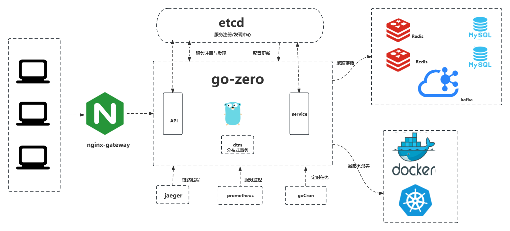

# go-zero-12306

# 项目介绍
> 更具https://github.com/nageoffer/12306 项目进行修改，使用主要技术为go-zero

- 目前处于对服务的拆分阶段

# 12306项目模块拆分

> github上项目模块划分图

如上图可知，项目分为5个模块，分别是：
- 网关服务 gateway-service
- 购票服务 ticket-service
- 订单服务 order-service
- 支付服务 pay-service
- 会员服务（相当于用户服务） user-service

## 项目技术架构图
> 在技术选型中，采用最新的 go-zero 微服务架构.(目前是确定使用这些技术，如果有大佬有更好的建议，欢迎提出)

# 目前接口完成情况

- [x] UserLoginController

  - [x] checkLogin
  - [x] login
  - [x] logout
- [x] UserInfoController

  - [x] queryUserByUsername
  - [x] queryActualUserByUsername
  - [x] hasUsername
  - [x] register
  - [x] update
  - [x] deletion
- [ ] PassengerController
  - [ ] listPassengerQueryByUsername
  - [ ] listPassengerQueryByIds
  - [ ] savePassenger
  - [ ] updatePassenger
  - [ ] removePassenger

