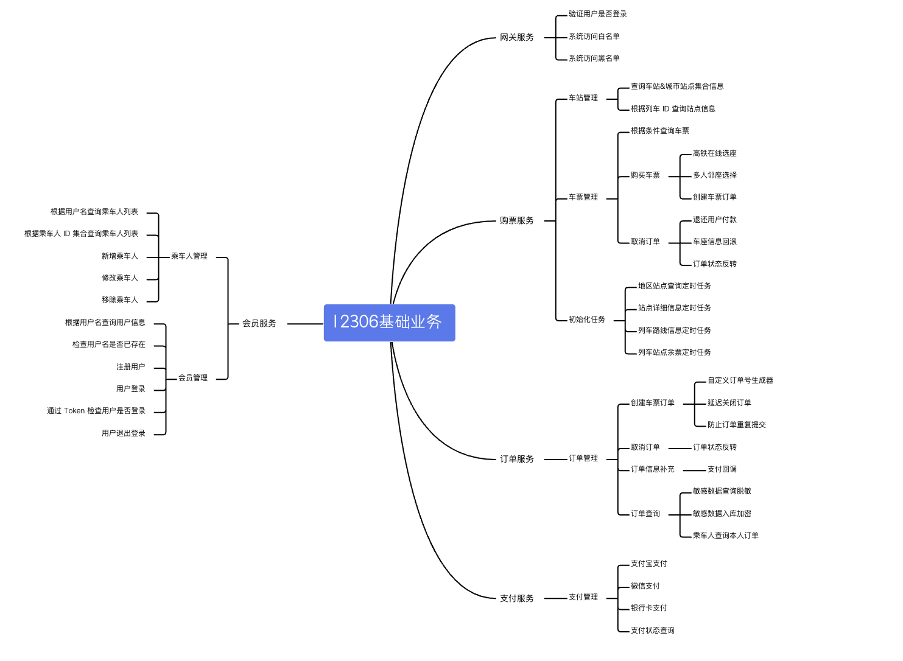

# 12306项目模块拆分

> github上项目模块划分图

如上图可知，项目分为5个模块，分别是：
- 网关服务 gateway-service
- 购票服务 ticket-service
- 订单服务 order-service
- 支付服务 pay-service
- 会员服务（相当于用户服务） user-service

## 项目技术架构图
在技术选型中，采用最新的 go-zero 微服务架构.(目前处于)

